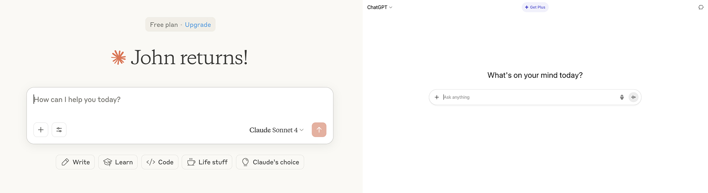
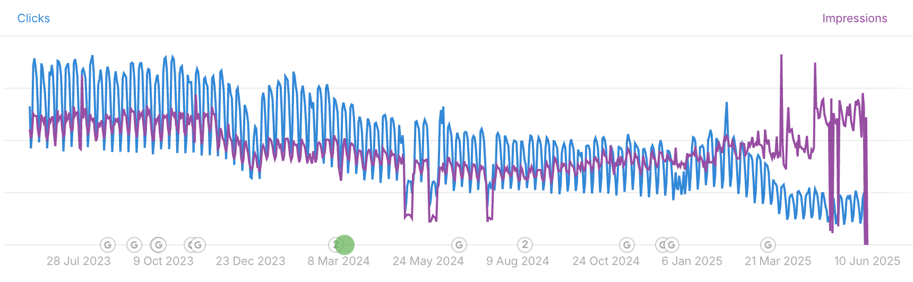

# Answer engine obscurity - How a simple UI is holding back the future of AEO

Updated on September 16, 2025 to [address emerging information regarding the great decoupling](#three-things-seo-and-content-teams-can-do-right-now)

Updated on September 29, 2025 to note that GEO, or Generative Engine Optimization is gaining significant traction as the term that will eventually be utilized to refer to this new era of search optimization

## The traditional SEO disconnect

Traditional SEO isn't dead, but adhering to it naively ignores AI-powered search engines that process queries through semantic understanding rather than keyword matching. [While Google maintains nearly 90% of global search traffic](https://learn.g2.com/top-10-search-engines), AI Overviews are now default and powered by Gemini, changing how content gets discovered.

I've analyzed a variety (exceeding dozens) of AEO articles, case studies, research papers, and talks, as well as several patents, and found a troubling pattern. **There's no consensus on how Answer Engine Optimization should work alongside traditional SEO**. Many discussions reference Google's dominance without acknowledging that this traffic now flows through AI systems operating on completely different principles.

This disconnect starts with something deceptively simple: the interface itself.

## The deceptive interface problem

AI interfaces appear deceptively simple because they hide complex, personalized processing behind a universal input box, creating false expectations about how AI actually works. Most software has razor-sharp purpose that the interface communicates clearly:

*   Calculator apps do math
    
*   Maps provide directions
    
*   Email clients send messages
    

**But how do you design an** _**everything engine**_**?** You don't. Instead, you provide a plain text input and let users define the software's purpose for each interaction.

What you see is an invitation to engage with natural language. This simplicity, combined with our experience with traditional search, creates a dangerous misconception: that AI works like a deterministic system where identical inputs produce identical outputs.

**Here's the first major divergence from traditional search:** Two users entering "Where should I go for Mediterranean food in Boston?" won't receive the same answer. The UI suggests they should, but the reality involves personalization, context, and semantic interpretation that happens completely behind the scenes. This hidden complexity is exactly why traditional SEO approaches fail with AI systems, and why understanding the multi-stage reality behind that simplified interface is crucial for content optimization.

## The obscured multi-stage reality

AI chatbots generate answers through a complex multi-stage process that runs behind that simple input box, with four critical stages directly impacting how your content gets discovered and cited.

Here's what actually happens when someone types a query:

### 1\. Query Analysis & Query Fan Out

The very first thing that happens when you enter a prompt in an AI is that the prompt is duplicated and rewritten a number of times, through a process that is now referred to as Query Fan Out. Different companies use different terms, we only know "query fan out" because [google filed a patent](https://patents.google.com/patent/WO2024064249A1/en). So if you asked Gemini "What is the best place to get Greek food in Boston?", the model might also look for answers to "What is the best place to get Mediterranean food in Boston?"

### 2\. User Embedding

AI doesn't just read the question and fan it out, it builds a comprehensive user profile based on historical activity, preferences, and other context. This profile gets tokenized (converted to numerical format) to match all other data in the system to tune the response, meaning identical queries from different users will diverge when personalization is applied. This is done in parallel with the query fan out to ensure semantically similar queries are informed by the user and their potential intent.

### 3\. Semantic Similarity Mapping

While scaffolding an initial response, the system plots your user profile, query, and potential answers in multidimensional vector space. Depending on the model, this happens across 800 to 3,072 dimensions. This is immensely more complex than returning a deterministic search engine results page for a keyword.

### 4\. Consensus Building

Initial response chunks go through rigorous comparison for accuracy and relevance (think a competitive bracket in sports, but ultra fast), factoring in user context and intent. When training data lacks consensus (has low answer confidence), models activate Retrieval Augmented Generation (RAG), which prompts a fast web crawl for high-fidelity responses with proper citations. RAG is often the reason SEO professionals over-rely on traditional SEO tactics in AEO, because here keyword rankings, domain authority, and some other SEO factors _**are**_ relevant.

### 5\. Response Synthesis

The personalized response converts from tokens back to natural language, incorporating user-specific context that explains why two people won't get identical answers to identical questions.

**Why this matters for content:** Each of these five stages represents an optimization opportunity that traditional SEO doesn't account for. Content isn't just competing for the number one spot on a SERP for some long tail keywords, it's fighting for semantic similarity to the question _**AND**_ the user, synthesis value, and citation worthiness across multi-dimensional spaces.

Understanding these hidden processes reveals why traditional SEO techniques fall short and why most current optimization strategies are inadvertently veering off course from how AI actually works. **These two paths will continue to diverge.**

## Why your current SEO strategy won't surface your content on AI platforms

Traditional SEO techniques fail on AI platforms because [AI operates on probabilistic rather than deterministic principles](https://ipullrank.com/how-ai-mode-works) (no good AEO article would be complete without a reference to some Mike King deep dives, where this deterministic vs. probabilistic theme is extremely prevalent), fundamentally changing how content gets discovered and valued.

These three core problems begin to explain why your current approach isn't working:

### The Keyword Paradigm Problem

Traditional SEO targets deterministic rankings: one keyword produces one search results page. AI results are probabilistic, meaning a single query can surface countless potential responses based on semantic similarity rather than exact matches. While competitors focus on traditional keywords, semantic clustering remains wide open for businesses ready to optimize for AI's multidimensional understanding.

### The Citation Challenge

Traditional SEO prioritizes backlink profiles, which still matter for Retrieval Augmented Generation (RAG) processes. However, natural language synthesis creates new opportunities: a contextually appropriate answer from your brand can outperform established authorities if you align your content with user intent and semantic relevance rather than just link equity.

### The Metrics Mismatch

Click-through rates have anchored SEO measurement for decades, but they're irrelevant for Answer Engine Optimization. AEO success happens before clicks, through answer inclusion, brand mentions, and synthesis value that builds awareness without requiring traffic. The measurement gap is real: as of September 2025, Google Search Console still offers no way to distinguish impressions from AI Overviews, AI mode, or traditional search results.

**The opportunity:** These gaps represent competitive advantages for content teams willing to think beyond traditional SEO metrics and embrace semantic optimization strategies.

## Why SEOs need to understand vector space and cosine similarity to optimize for AI platforms

### Understanding Vector Space in Simple Terms

Imagine shrinking AI's 3,072-dimensional vector space down to the 3D world we all live in. Every query, user embedding, and potential answer becomes a point in this space, each with magnitude and angle relative to the origin (0,0,0). The answer that sits closest to both the query vector and user embedding vector wins the citation. Is this an oversimplification? Yes. Is it a valuable visual to begin to understand how AI actually works? Also, yes.

### Three Critical Implications:

#### Proximity Precision Matters

*   A few degrees difference determines citation or mention vs. invisibility
    
*   Small semantic improvements can massively increase visibility
    
*   Mathematical closeness can win over stacked domain authority
    

#### User Context Shapes Results

*   User embeddings personalize which content appears relevant
    
*   Your ideal customer profile influences optimization strategy
    
*   Content must align with specific user embeddings
    

That last bullet point warrants some additional weight. Imagine your ICP as a mappable vector in space. This is a massive opportunity to mathematically tune your content to your desired audience. You're not working with just qualitative tags to define your prospects, instead you have a mathematical profile to work with, and the tools to create these profiles and to map your content and users in multi-dimensional space are coming.

#### Query Expansion Creates Blind Spots

*   Ranking for target queries doesn't guarantee related query visibility
    
*   Semantic variations surface completely different content
    
*   Query fan-out creates complex technical optimization challenges
    

#### What You Can Do About It

Focus on semantic similarity rather than individual keywords, optimize content for your specific user profiles, and build topical authority that spans multiple related vector positions. As an example, when you write a blog post for your Greek Restaurant in Boston consider the fact that you have three dollar signs next to your google business, that Greek food is a subset of Mediterranean food, and remember that you don't need to rank #1 anymore, you just have to answer the right questions.

## Three things SEO and content teams can do right now

The Great Decoupling, seeing impressions and click throughs diverge so quickly, can seem scary, but there is some hope in the divergence, clicks aren't just going down, impressions are going way up.

**Edit:** Over the weekend, google began testing the disabling of &num=100 as a search parameter, a tactic used by a variety of keyword ranking tools that scrape web results for keywords using that parameter. While this is an emerging topic, it does seem like keyword scrapers may own some or most of the responsibility for the massive increase in impressions.

For a more detailed walkthrough about this topic, [check out this article from Brodie Clark Consulting](https://brodieclark.com/the-great-decoupling-num100/), or search &num=100 on LinkedIn.

_**The image above may be misleading about the legitimacy of the great decoupling**_

1.  **Content strategy:** qualitatively build query fan outs **every time** you develop new content. Tune different passages (sections of your content) to the different query variations. Always pick an ICP for a piece of content, and speak directly to them.
    
2.  **Building reports:** right now, build a filter in your traffic sources report to note when your utm\_source, utm\_medium, or utm\_campaign (may be listed as sessions source, session medium, session campaign) come from any of the well know AI tools. I build reports in looker, so my filters look like "session source" contains "\[AI tool url\]".
    
3.  **Education:** the landscape is changing, and teams need to be ready to learn and implement new tools when they arise. Moz might not own as much of the AEO market as they do the SEO market.
    

## Stay informed

I'll be writing on this and a variety of other topics weekly (maybe). I feel inclined to end this by encouraging you to sign up for a newsletter that I don't have, or to subscribe to an RSS feed that I haven't set up yet. Those things might come in the future, but for now I'd encourage you to [connect with me on LinkedIn](https://www.linkedin.com/in/john-wheeler-5697431b9/) where I'll be sharing updates.